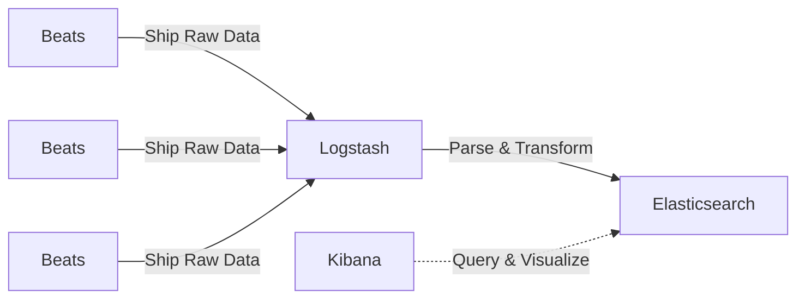

## What is Elastic Stack?

Elastic stack(or ELK stack) is one of the famous sets of components that are widely used to search, analyze, and visualize data from any source. The most common use case of the Elastic stack is to monitor the Kubernetes logs for debugging and analyzing performance.

The elastic stack consists of the following components:
- **Elasticsearch**: A distributed search and analytics engine that stores and indexes data.
- **Logstash**: A data processing pipeline that ingests, transforms, and sends data to Elasticsearch.
- **Kibana**: A visualization tool that provides interactive dashboards for data exploration.
- **Beats**: Lightweight data shippers (e.g., Filebeat) that collect logs and metrics from different sources.

## How does it work?

1. Beats (e.g., Filebeat) collect logs from Kubernetes pods and nodes.
2. Logstash processes and enriches the logs before sending them to Elasticsearch.
3. Elasticsearch stores and indexes the logs for efficient querying.
4. Kibana provides a user-friendly interface to visualize and analyze the logs.



## Deploying Elastic Stack on kubernetes

### Prerequisites

- A running Kubernetes cluster.
- Helm v3 installed.

### Steps:

1. Create a new namespace and add Helm Repositories

    ```bash
    kubectl create ns elk

    helm repo add elastic https://helm.elastic.co
    helm search repo elastic
    ```

2. Deploying the **Elasticearch**

    - Create a `elasticsearch-values.yaml` for the  configuration

        ```yaml
        replicas: 1
        minimumMasterNodes: 1

        secret:
          enabled: true
          password: "password"

        resources:
          requests:
            cpu: "200m"
            memory: "200Mi"
          limits:
            cpu: "1000m"
            memory: "2Gi"

        antiAffinity: "soft"
        ```


    - Install the elasticsearch helm chart

        ```bash
        helm install elasticsearch elastic/elasticsearch -n elk -f elasticsearch-values.yaml
        ```

3. Deploying the **Logstash**

    - Create a `logstash-values.yaml` for the  configuration

        ```yaml
        extraEnvs:
          - name: "ELASTICSEARCH_USERNAME"
            valueFrom:
              secretKeyRef:
                name: elasticsearch-master-credentials
                key: username
          - name: "ELASTICSEARCH_PASSWORD"
            valueFrom:
              secretKeyRef:
                name: elasticsearch-master-credentials
                key: password

        logstashConfig:
          logstash.yml: |
            http.host: 0.0.0.0
            xpack.monitoring.enabled: false

        logstashPipeline:
          logstash.conf: |
            input {
              beats {
                port => 5044
              }
            }

            output {
              elasticsearch {
                hosts => ["https://elasticsearch-master:9200"]
                cacert => "/usr/share/logstash/config/elasticsearch-master-certs/ca.crt"
                user => '${ELASTICSEARCH_USERNAME}'
                password => '${ELASTICSEARCH_PASSWORD}'
               }
            }

        secretMounts:
          - name: "elasticsearch-master-certs"
            secretName: "elasticsearch-master-certs"
            path: "/usr/share/logstash/config/elasticsearch-master-certs"

        service:
          type: ClusterIP
          ports:
            - name: beats
              port: 5044
              protocol: TCP
              targetPort: 5044
            - name: http
              port: 8080
              protocol: TCP
              targetPort: 8080

        resources:
          requests:
            cpu: "200m"
            memory: "200Mi"
          limits:
            cpu: "1000m"
            memory: "1536Mi"
        ```

    - Install the logstash helm chart

        ```bash
        helm install logstash elastic/logstash -n elk -f logstash-values.yaml
        ```

4. Deploying the **Filebeat(Beats)**

    - Create a `filebeat-values.yaml` for the  configuration

        ```yaml
        daemonset:
          filebeatConfig:
            filebeat.yml: |
              filebeat.inputs:
              - type: container
                paths:
                  - /var/log/containers/*.log
                processors:
                - add_kubernetes_metadata:
                    host: ${NODE_NAME}
                    matchers:
                    - logs_path:
                        logs_path: "/var/log/containers/"

              output.logstash:
                hosts: ["logstash-logstash:5044"]
        ```

    - Install the filebeat helm chart

        ```bash
        helm install filebeat elastic/filebeat  -n elk -f filebeat-values.yaml
        ```

4. Deploying the **Kibana**

    - Install the kibana  helm chart

        ```bash
        helm install kibana elastic/kibana -n elk
        ```
    
5. Once the helm charts are installed, check the pods in `elk` namespace

    ```bash
    ➜ kubectl get pod -n elk
    NAME                           READY   STATUS    RESTARTS   AGE
    elasticsearch-master-0         1/1     Running   0          17m
    filebeat-filebeat-vzg5x        1/1     Running   0          4m59s
    kibana-kibana-894d6648-mk2sd   1/1     Running   0          72s
    logstash-logstash-0            1/1     Running   0          11m
    ```
5. Access the kibana dashboard
    
    - Use kubernetes port-fowarding to access the kibana dashboard

        ```bash
        kubectl port-forward svc/kibana-kibana 5601:5601 -n elk
        ```

    - Open Kibana in your browser
        - URL: `http://localhost:5601`
        - Login: `elastic/password`

    - Go to the Discover tab and create a new index

    - Once the index is created the pod logs should be visible in the kibana

## Conclusion
The Elastic Stack (ELK) provides a robust solution for centralized logging in Kubernetes. By deploying Filebeat, Logstash, Elasticsearch, and Kibana, you can efficiently collect, process, store, and visualize logs.

For production, consider:
- Increasing Elasticsearch replicas for high availability.
- Configuring persistent storage for Elasticsearch data.
- Enabling TLS for secure communication between components.
