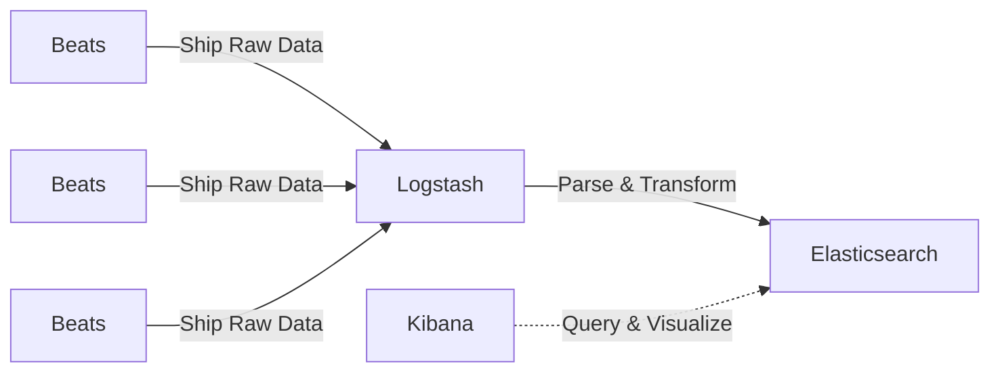

## What is Elastic Stack?

Elastic stack(or ELK stack) is one of the famous sets of components that are widely used to search, analyze, and visualize data from any source. The most common use case of the Elastic stack is to monitor the Kubernetes logs for debugging and analyzing performance.
The elastic stack consists of the following components:
- Elasticsearch: distributed search engine
- Logstash: data processing pipeline
- Kibana: data visualizer
- Beats: data collection agent

## How does it work?

It starts with the Beats application, which collects data from the source and then sends it to Logstash for processing. Logstash processes and transforms the data. The processed data is then sent to the Elasicsearch where data is indexed in structured format. The indexed data can then be visualized with the help of Kibana.



## Deploying Elastic Stack on kubernetes

### Prerequisites

- Kubernetes Cluster
- Helm v3

### Steps:

1. Create a new namespace and add the Elastic helm repository

    ```bash
    kubectl create ns elk

    helm repo add elastic https://helm.elastic.co
    helm search repo elastic
    ```

2. Deploying the **Elasticearch**

    - Create a `elasticsearch-values.yaml` for the  configuration

        ```yaml
        ```

    - Install the elasticsearch helm chart

        ```bash
        helm install elasticsearch elastic/elasticsearch -n elk -f elasticsearch-values.yaml
        ```
    
    - Once the helm chart is insatlled, the elasticsearch pod should be running 

        ```bash
        kubectl get pod -n elk
        ```

3. Deploying the **Logstash**

    - Create a `logstash-values.yaml` for the  configuration

        ```yaml
        ```

    - Install the logstash helm chart

        ```bash
        helm install logstash elastic/logstash -n elk -f logstash-values.yaml
        ```
    
    - Once the helm chart is insatlled, the logstash pod should be running 

        ```bash
        kubectl get pod -n elk
        ```

4. Deploying the **Filebeat(Beats)**

    - Create a `filebeat-values.yaml` for the  configuration

        ```yaml
        ```

    - Install the filebeat helm chart

        ```bash
        helm install filebeat elastic/filebeat  -n elk -f filebeat-values.yaml
        ```
    
    - Once the helm chart is installed, the filebeat pod should be running 

        ```bash
        kubectl get pod -n elk
        ```

4. Deploying the **Kibana**

    - Create a `kibana -values.yaml` for the  configuration

        ```yaml
        ```

    - Install the kibana  helm chart

        ```bash
        helm install kibana elastic/kibana -n elk -f kibana -values.yaml
        ```
    
    - Once the helm chart is installed, the kibana  pod should be running 

        ```bash
        kubectl get pod -n elk
        ```